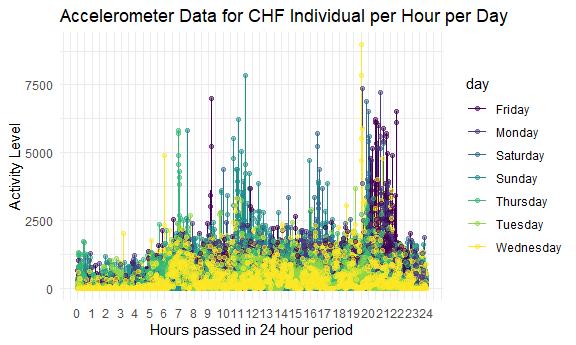
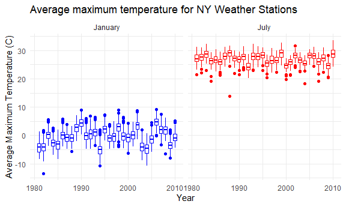

p8105_hw3_waa2119
================
William Anderson
2022-10-12

``` r
library(tidyverse)
library(dplyr)
library(p8105.datasets)
library(patchwork)
library(ggridges)

knitr::opts_chunk$set(
  fig.width = 6,
  fig.asp = .6,
  out.width = "90%"
)

theme_set(theme_minimal() + theme(legend.position = "bottom"))

options(
  ggplot2.continuous.colour = "viridis",
  ggplot2.continuous.fill = "viridis"
)

scale_colour_discrete = scale_colour_viridis_d
scale_fill_discrete = scale_fill_viridis_d
```

# Problem 2

Loading the accelerometer data

``` r
accel_data = 
  
  read_csv("HW3_Data/accel_data.csv") %>%
  
  janitor::clean_names() %>%
  
  pivot_longer(
    activity_1:activity_1440,
    
    names_to = "activity_count",
    
    names_prefix = "activity_", 
    
    values_to = "activity_values") %>%
  
  mutate(type_of_day = 
              ifelse(day == "Saturday" | day == "Sunday", "Weekend", "Weekday")) %>%
  
  mutate(activity_count = as.numeric(activity_count), hours_in_day = activity_count/60)
  

head(accel_data, 10)
```

    ## # A tibble: 10 × 7
    ##     week day_id day    activity_count activity_values type_of_day hours_in_day
    ##    <dbl>  <dbl> <chr>           <dbl>           <dbl> <chr>              <dbl>
    ##  1     1      1 Friday              1            88.4 Weekday           0.0167
    ##  2     1      1 Friday              2            82.2 Weekday           0.0333
    ##  3     1      1 Friday              3            64.4 Weekday           0.05  
    ##  4     1      1 Friday              4            70.0 Weekday           0.0667
    ##  5     1      1 Friday              5            75.0 Weekday           0.0833
    ##  6     1      1 Friday              6            66.3 Weekday           0.1   
    ##  7     1      1 Friday              7            53.8 Weekday           0.117 
    ##  8     1      1 Friday              8            47.8 Weekday           0.133 
    ##  9     1      1 Friday              9            55.5 Weekday           0.15  
    ## 10     1      1 Friday             10            43.0 Weekday           0.167

This data set is comprised of accelerometer data which during
observation periods measures “activity counts” in a short period;
one-minute intervals are common.

This data set contains five weeks of accelerometer data collected on a
63 year-old male with BMI 25, who was admitted to the Advanced Cardiac
Care Center of Columbia University Medical Center and diagnosed with
congestive heart failure (CHF)

The variables in this accelerometer data set are week, day_id, day,
activity_count, activity_values, type_of_day, hours_in_day

The day_id variable corresponds to the numeric day value the activity
levels were recorded on. The activity count is a per minute interval
count corresponding to the measured activity value for that minute. The
type of day variable indicates whether the day is a weekday or weekend
and the hours in day variable converts the activity count values into
hourly values for each day.

The number of observations are 50400

The dimensions of the data set are 50400, 7

Now we aggregate across minutes to create a total activity variable for
each day, and create a table showing these values

``` r
accel_data_summary =
  
  accel_data %>%
  
  mutate(
    day = as.factor(day)
    ) %>%
  
  mutate(day = factor(day, levels = c("Monday", "Tuesday", "Wednesday", "Thursday", "Friday", "Saturday", "Sunday"))) %>%
  
  group_by(day, week) %>%
  
  summarize(total_activity_levels = sum(activity_values), .groups = "drop") %>%
  
  ungroup()

head(accel_data_summary, 10)
```

    ## # A tibble: 10 × 3
    ##    day      week total_activity_levels
    ##    <fct>   <dbl>                 <dbl>
    ##  1 Monday      1                78828.
    ##  2 Monday      2               295431 
    ##  3 Monday      3               685910 
    ##  4 Monday      4               409450 
    ##  5 Monday      5               389080 
    ##  6 Tuesday     1               307094.
    ##  7 Tuesday     2               423245 
    ##  8 Tuesday     3               381507 
    ##  9 Tuesday     4               319568 
    ## 10 Tuesday     5               367824

It is difficult to observe any trends by just viewing the data in a
table, graphing the data would be more helpful.

Now we plot to observe any trends

``` r
ggplot(accel_data_summary, aes(x = day, y = total_activity_levels, color = week, group = week)) + 
  
  geom_line() + 
  
  geom_point() + 
  
  labs(
    
    title = "Accelerometer Data for CHF Individual per 24 Hours per Week", 
    
    y = "Total Activity Level",
    
    x = "") +
  
  theme(legend.position = "right") 
```


From the plot we can see some trends. Total Activity levels were
increasing from Tuesday - Wednesday for each week, Saturdays for weeks 4
and 5 had zero total activity level. The highest total actvity levels
were recorded on Monday of Week 3 and Sunday of Week 1.

Now we will make a plot showing the 24-hour activity time courses for
each day

``` r
ggplot(accel_data, aes(x = hours_in_day, y = activity_values, color = day)) + 
  
  geom_line() + 
  
  geom_point(alpha = 0.5) + 
  
  scale_x_continuous(breaks = c(0:24)) +
  
  labs(
    
    title = "Accelerometer Data for CHF Individual per Hour per Day", 
    
    y = "Activity Level",
    
    x = "Hours passed in 24 hour period") + 
  
    theme(legend.position = "right")
```



From the graph we can see that activity levels were lowest from the
hours of 12 AM - 5 AM, approximately each day, then increasing
consistently from 6 AM - 10 PM each day. Friday had a very large spike
of activity level between 7 PM - 10 PM and Sunday had a large spike
between 10 AM - 12 PM. Wednesday had the highest activity level
occurring at 8 PM.

# Problem 3

Loading the NY NOAA data set

``` r
data("ny_noaa")

head(ny_noaa, 10)
```

    ## # A tibble: 10 × 7
    ##    id          date        prcp  snow  snwd tmax  tmin 
    ##    <chr>       <date>     <int> <int> <int> <chr> <chr>
    ##  1 US1NYAB0001 2007-11-01    NA    NA    NA <NA>  <NA> 
    ##  2 US1NYAB0001 2007-11-02    NA    NA    NA <NA>  <NA> 
    ##  3 US1NYAB0001 2007-11-03    NA    NA    NA <NA>  <NA> 
    ##  4 US1NYAB0001 2007-11-04    NA    NA    NA <NA>  <NA> 
    ##  5 US1NYAB0001 2007-11-05    NA    NA    NA <NA>  <NA> 
    ##  6 US1NYAB0001 2007-11-06    NA    NA    NA <NA>  <NA> 
    ##  7 US1NYAB0001 2007-11-07    NA    NA    NA <NA>  <NA> 
    ##  8 US1NYAB0001 2007-11-08    NA    NA    NA <NA>  <NA> 
    ##  9 US1NYAB0001 2007-11-09    NA    NA    NA <NA>  <NA> 
    ## 10 US1NYAB0001 2007-11-10    NA    NA    NA <NA>  <NA>

``` r
ny_noaa_structure = print(str(ny_noaa))
```

    ## tibble [2,595,176 × 7] (S3: tbl_df/tbl/data.frame)
    ##  $ id  : chr [1:2595176] "US1NYAB0001" "US1NYAB0001" "US1NYAB0001" "US1NYAB0001" ...
    ##  $ date: Date[1:2595176], format: "2007-11-01" "2007-11-02" ...
    ##  $ prcp: int [1:2595176] NA NA NA NA NA NA NA NA NA NA ...
    ##  $ snow: int [1:2595176] NA NA NA NA NA NA NA NA NA NA ...
    ##  $ snwd: int [1:2595176] NA NA NA NA NA NA NA NA NA NA ...
    ##  $ tmax: chr [1:2595176] NA NA NA NA ...
    ##  $ tmin: chr [1:2595176] NA NA NA NA ...
    ##  - attr(*, "spec")=
    ##   .. cols(
    ##   ..   id = col_character(),
    ##   ..   date = col_date(format = ""),
    ##   ..   prcp = col_integer(),
    ##   ..   snow = col_integer(),
    ##   ..   snwd = col_integer(),
    ##   ..   tmax = col_character(),
    ##   ..   tmin = col_character()
    ##   .. )
    ## NULL

The ny_noaa data set has weather data from the National Oceanic and
Atmospheric Association (NOAA) and specifically contains weather
observations only within the entire state of New York.

The key variables are id, date, prcp, snow, snwd, tmax, tmin

The id corresponds to the New York weather station ID from which the
data was recorded, date is the date of observation, prcp is
precipitation in tenths of mm, snow is recorded snowfall in mm, snwd is
snow depth in mm, tmax is maximum temperature in tenths of celsius, and
tmin is minimum temperature in tenths of celsius

The entire data set structure is a tibble with the id, date, tmax, and
tmin columns being characters and prcp, snow, and snwd columns being
integers.

The size of the data is 2595176, 7

Some entries in the prcp, snow, snwd, tmax, and tmin values are missing
(N/A) which does not allow for a robust analysis of this data

The number of missing data in the precipitation column is 145838

The number of missing data in the recorded snowfall column is 381221

The number of missing data in the snow depth column is 591786

The number of missing data in the maximum temperature column is 1134358

The number of missing data in the minimum temperature column is 1134420

Now we will clean the data

``` r
ny_noaa_tidy = 
  
  ny_noaa %>%
  
  janitor::clean_names() %>%
  
  separate(date, into = c("Year", "Month", "Day")) %>%
  
  mutate(tmax = as.numeric(tmax), tmin = as.numeric(tmin), Year = as.numeric(Year), Month = as.numeric(Month), Day = as.numeric(Day), snow = as.numeric(snow)) %>%
  
   mutate(Month = month.name[Month]) %>%
  
  mutate(tmax = tmax/10, 
         tmin = tmin/10, 
         prcp = prcp/10)
  

most_snow = names(sort(summary(as.factor(ny_noaa_tidy$snow)), decreasing = TRUE))[1:1]
```

Since the precipitation and max and min temperature values were recorded
in tenths of mm and degrees C, we have converted them back into their
standard values by dividing the values by 10.

The most common snowfall value in New York is 0 mm because New York has
a temperate climate and has many days in which it does not receive snow
across the state.

Now we will make a two-panel plot showing the average max temperature in
January and in July in each station across years.

``` r
ny_noaa_summary =
  
  ny_noaa_tidy %>%
  
  filter(Month %in% c("January", "July")) %>%
  
  group_by(id, Year, Month) %>%
  
  summarize(mean_tmax = mean(tmax), na.rm = TRUE)

ggplot(ny_noaa_summary, aes(x = Year, y = mean_tmax, group = Year, color = Month)) +
  
    geom_boxplot() + 
  
    facet_grid(. ~ Month) +
  
    scale_color_manual(values = c("January" = "blue", "July" = "red")) + 
  
    theme(legend.position = "none") + 
  
  labs(
    
    title = "Average maximum temperature for NY Weather Stations",
    
    y = "Average Maximum Temperature (C)")
```



The average maximum temperatures are observably higher in July in New
York compared to January with January ranging between -5 to 5 degrees
Celsius per year and July being consistently between 25 - 30 degrees
Celsius every year. Some years contain outliers as January can be seen
having anomalous low and high temperatures and July frequently has years
with anomalous low temperatures outside the main cluster of data points.

Now we will make a two-panel plot showing tmax vs tmin for the full
dataset and a plot showing the distribution of snowfall values greater
than 0 and less than 100 separately by year

Making max/min temperature graph

``` r
max_min_temp_graph = 
  
  ggplot(ny_noaa_tidy, aes(x = tmin, y = tmax)) + 
  
      geom_hex() + 
  
      theme(legend.position = "none") + 
  
  labs(
    
    title = "NY Statewide Temps",
    
    y = "Maximum Temperature (C)",
    
    x = "Minimum Temperature (C)")
```

Making snowfall distribution graph

``` r
snowfall_dist =
  
  ny_noaa_tidy %>%
  
  filter(snow > 0 & snow < 100)
  

snowfall_dist_graph = 
  
  ggplot(snowfall_dist, aes(x = snow, y = Year, group = Year, fill = Year)) + 
  
  geom_density_ridges() + 
  
  theme(legend.position = "right") + 
  
  scale_x_continuous(breaks = seq(0, 100, by = 20)) +
  
  scale_y_continuous(breaks = c(1980, 1985, 1990, 1995, 2000, 2005, 2010)) + 
  
  labs(
    
    title = "Snowfall per Year in NY",
    
    y = "Year", 
    
    x = "Snowfall (mm)")
```

Patching these two plots together..

``` r
max_min_temp_graph + snowfall_dist_graph
```


We can see that maximum and minimum temperatures in New York have a
positively linear correlation. This makes sense as we would expect a
high minimum temperature value to correlate with a high maximum
temperature value and vice versa. There are some outliers in this plot
but overall it shows a positively linear correlation. In the snowfall
density graph we see that the most frequent values are between 0 - 25 mm
of snowfall per year, and each year has a very similar distribution as
almost every year received 50 and 75 mm of snow in addition to the main
distribution being between 0 - 25 mm.
