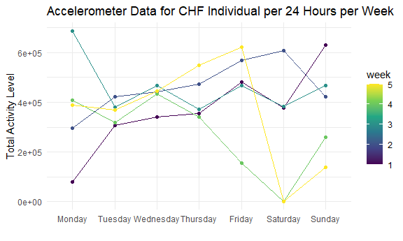

p8105_hw3_waa2119
================
William Anderson
2022-10-12

``` r
library(tidyverse)
library(dplyr)
library(p8105.datasets)


knitr::opts_chunk$set(
  echo = TRUE,
  warning = FALSE,
  fig.width = 6,
  fig.asp = .6,
  out.width = "90%"
)

theme_set(theme_minimal() + theme(legend.position = "bottom"))

options(
  ggplot2.continuous.colour = "viridis",
  ggplot2.continuous.fill = "viridis"
)

scale_colour_discrete = scale_colour_viridis_d
scale_fill_discrete = scale_fill_viridis_d
```

# Problem 2

Loading the accelerometer data

``` r
accel_data = 
  read_csv("HW3_Data/accel_data.csv") %>%
  
  janitor::clean_names() %>%
  
  pivot_longer(
    activity_1:activity_1440, 
    names_to = "activity_count",
    names_prefix = "activity_", 
    values_to = "acceleration_values") %>%
  
  mutate(type_of_day = 
              ifelse(day == "Saturday" | day == "Sunday", "Weekend", "Weekday"))
```

    ## Rows: 35 Columns: 1443
    ## ── Column specification ────────────────────────────────────────────────────────
    ## Delimiter: ","
    ## chr    (1): day
    ## dbl (1442): week, day_id, activity.1, activity.2, activity.3, activity.4, ac...
    ## 
    ## ℹ Use `spec()` to retrieve the full column specification for this data.
    ## ℹ Specify the column types or set `show_col_types = FALSE` to quiet this message.

``` r
head(accel_data, 10)
```

    ## # A tibble: 10 × 6
    ##     week day_id day    activity_count acceleration_values type_of_day
    ##    <dbl>  <dbl> <chr>  <chr>                        <dbl> <chr>      
    ##  1     1      1 Friday 1                             88.4 Weekday    
    ##  2     1      1 Friday 2                             82.2 Weekday    
    ##  3     1      1 Friday 3                             64.4 Weekday    
    ##  4     1      1 Friday 4                             70.0 Weekday    
    ##  5     1      1 Friday 5                             75.0 Weekday    
    ##  6     1      1 Friday 6                             66.3 Weekday    
    ##  7     1      1 Friday 7                             53.8 Weekday    
    ##  8     1      1 Friday 8                             47.8 Weekday    
    ##  9     1      1 Friday 9                             55.5 Weekday    
    ## 10     1      1 Friday 10                            43.0 Weekday

This data set is comprised of accelerometer data which during
observation periods measures “activity counts” in a short period;
one-minute intervals are common. Because accelerometers can be worn
comfortably and unobtrusively, they produce around-the-clock
observations.

This data set contains five weeks of accelerometer data collected on a
63 year-old male with BMI 25, who was admitted to the Advanced Cardiac
Care Center of Columbia University Medical Center and diagnosed with
congestive heart failure (CHF)

The variables in this accelerometer data set are week, day_id, day,
activity_count, acceleration_values, type_of_day

The number of observations are 50400

The dimensions of the data set are 50400, 6

Now we aggregate across minutes to create a total activity variable for
each day, and create a table showing these values

``` r
accel_data_summary =
  
  accel_data %>%
  
  mutate(
    day = as.factor(day)
    ) %>%
  
  mutate(day = factor(day, levels = c("Monday", "Tuesday", "Wednesday", "Thursday", "Friday", "Saturday", "Sunday"))) %>%
  
  group_by(day, week) %>%
  
  summarize(total_activity_levels = sum(acceleration_values), .groups = "drop") %>%
  
  ungroup()

head(accel_data_summary, 10)
```

    ## # A tibble: 10 × 3
    ##    day      week total_activity_levels
    ##    <fct>   <dbl>                 <dbl>
    ##  1 Monday      1                78828.
    ##  2 Monday      2               295431 
    ##  3 Monday      3               685910 
    ##  4 Monday      4               409450 
    ##  5 Monday      5               389080 
    ##  6 Tuesday     1               307094.
    ##  7 Tuesday     2               423245 
    ##  8 Tuesday     3               381507 
    ##  9 Tuesday     4               319568 
    ## 10 Tuesday     5               367824

Now we plot to observe any trends

``` r
ggplot(accel_data_summary, aes(x = day, y = total_activity_levels, color = week, group = week)) + 
  
  geom_line() + 
  
  geom_point() + 
  
  labs(
    title = "Accelerometer data for one person per 24 hours"
  )
```



Activity levels were consistently increasing from Tuesday - Wednesday
for each week, Saturdays for weeks 4 and 5 had no activity level

## Problem 3

Loading the NY NOAA data set

``` r
data("ny_noaa")

head(ny_noaa, 10)
```

    ## # A tibble: 10 × 7
    ##    id          date        prcp  snow  snwd tmax  tmin 
    ##    <chr>       <date>     <int> <int> <int> <chr> <chr>
    ##  1 US1NYAB0001 2007-11-01    NA    NA    NA <NA>  <NA> 
    ##  2 US1NYAB0001 2007-11-02    NA    NA    NA <NA>  <NA> 
    ##  3 US1NYAB0001 2007-11-03    NA    NA    NA <NA>  <NA> 
    ##  4 US1NYAB0001 2007-11-04    NA    NA    NA <NA>  <NA> 
    ##  5 US1NYAB0001 2007-11-05    NA    NA    NA <NA>  <NA> 
    ##  6 US1NYAB0001 2007-11-06    NA    NA    NA <NA>  <NA> 
    ##  7 US1NYAB0001 2007-11-07    NA    NA    NA <NA>  <NA> 
    ##  8 US1NYAB0001 2007-11-08    NA    NA    NA <NA>  <NA> 
    ##  9 US1NYAB0001 2007-11-09    NA    NA    NA <NA>  <NA> 
    ## 10 US1NYAB0001 2007-11-10    NA    NA    NA <NA>  <NA>

This data set from the National Oceanic and Atmospheric Association
(NOAA) and contains records from over 100,000 stations in 180 countries
and territories. NCEI provides numerous daily variables, including
maximum and minimum temperature, total daily precipitation, snowfall,
and snow depth; however, about one half of the stations report
precipitation only. Both the record length and period of record vary by
station and cover intervals ranging from less than a year to more than
175 years.

Our data set specifically contains observations within the state of New
York

The size of the data is 2595176, 7

The structure of this data is

The key variables are id, date, prcp, snow, snwd, tmax, tmin

The id corresponds to the weather station ID from which the data was
recorded, date is the date of observation, prcp is precipitation in
tenths of mm, snow is recorded snowfall in mm, snwd is snow depth in mm,
tmax is maximum temperature in tenths of celsius, tmin is minimum
temperature in tenths of celsius

Some entries in the prcp, snow, snwd, tmax, and tmin values are missing
which does not allow for a robust analysis of this data

The number of missing data in the prcp column is 145838

The number of missing data in the prcp column is 591786

The number of missing data in the prcp column is 1134358

The number of missing data in the prcp column is 1134420

Now we will clean the data

``` r
ny_noaa_tidy = 
  
  sample_n(ny_noaa, 5000) %>%
  
  janitor::clean_names() %>%
  
  separate(date, into = c("Year", "Month", "Day")) %>%
  
  mutate(tmax = as.numeric(tmax), tmin = as.numeric(tmin), Year = as.numeric(Year), Month = as.numeric(Month), Day = as.numeric(Day), snow = as.numeric(snow)) %>%
  
   mutate(Month = month.name[Month]) %>%
  
  mutate(tmax = tmax/10, 
         tmin = tmin/10, 
         prcp = prcp/10)
  
most_snow = sort(table(ny_noaa_tidy$snow),decreasing = TRUE)[1:5]
```

The most common snowfall values are 3850, 57, 45, 45, 25. The most
common snowfall value is 0 mm because New York has many days in which it
does not receive snow across the state. The next most common snowfall
estimates are relatively small numbers as well since New York does not
usually receive large amounts of snow each year.

Now we will make a two-panel plot showing the average max temperature in
January and in July in each station across years.

``` r
ny_noaa_summary =
  ny_noaa_tidy %>%
  
  filter(Month %in% c("January", "July")) %>%
  
  group_by(id, Year, Month) %>%
  
  summarize(mean_tmax = mean(tmax), na.rm = TRUE)
```

    ## `summarise()` has grouped output by 'id', 'Year'. You can override using the
    ## `.groups` argument.

``` r
ggplot(ny_noaa_summary, aes(x = Year, y = mean_tmax, group = id, color = Month)) + 
    geom_point(alpha = 0.5) + 
    geom_smooth(alpha = 0.3, se = FALSE) + 
    facet_grid(. ~ Month) +
    theme(legend.position = "none") + 
  labs(
    title = "Average maximum temperature for NY Weather Stations", 
    y = "Average Maximum Temperature (C)"
      )
```

    ## `geom_smooth()` using method = 'loess' and formula 'y ~ x'


The average temperatures are observably higher in July in New York
compared to January, some years contain outliers as January can be seen
having anomalous low temperatures and July has years with anomalous high
temperatures outside the main cluster of data points.
